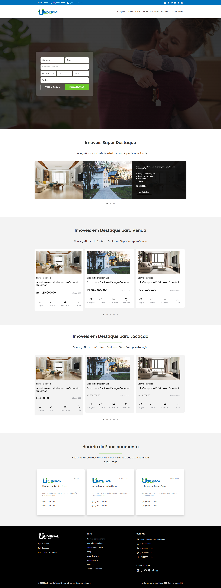

# 🏡 Landing Page – Teste Técnico

Projeto desenvolvido como parte de um teste técnico para diagramação de página web.

---

## 📌 Visão Geral

Landing page construída a partir de layout fornecido pelo avaliador, seguindo as especificações solicitadas.  
Todos os requisitos foram atendidos: diagramação fiel, responsividade, carrosséis funcionais e adaptação para resolução de **480px**.

---

## 🧰 Tecnologias Utilizadas

<table>
  <tr>
    <td align="center"><br>HTML5</td>
    <td align="center"><br>CSS3</td>
    <td align="center"><br>Bootstrap</td>
    <td align="center"><br>JavaScript</td>
  </tr>
</table>

---

## ✅ Requisitos Atendidos

- Estrutura HTML semântica
- Estilização com CSS e classes do Bootstrap
- Carrosséis funcionais implementados com **Slick Carousel**
- Responsividade garantida para **480px**

---

## 🖼 Captura de Tela

> Como se trata de uma landing page estática, segue a visualização do projeto concluído:



---

## 🚀 Como Visualizar

1. Baixe ou clone este repositório:
   ```bash
   git clone https://github.com/seu-usuario/seu-repositorio.git
